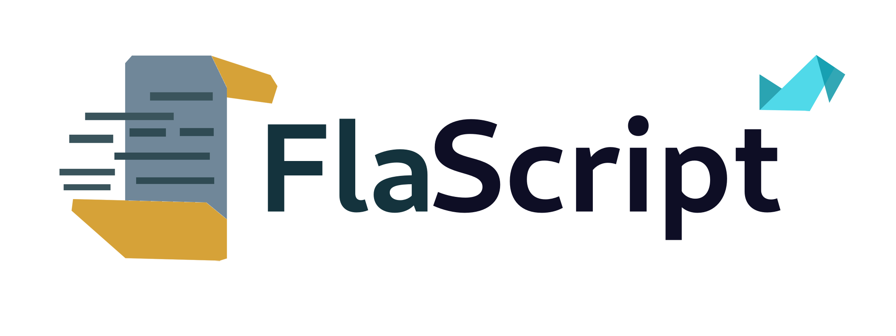

# Fegeya FlaScript
## Fegeya FlaScript is new generation scripting language.



## A taste of FlaScript
```go
defin[slashn] -> print(newline) <-

func -> PrintWithColor() {
    print(colorized[:1, 33:]) -> "Whoa! Hello developer!" <-
    put[slashn]
}

main() -> main {
    func -> PrintWithColor()
}
```

#### Fegeya FlaScript licensed under the terms of MIT License.
